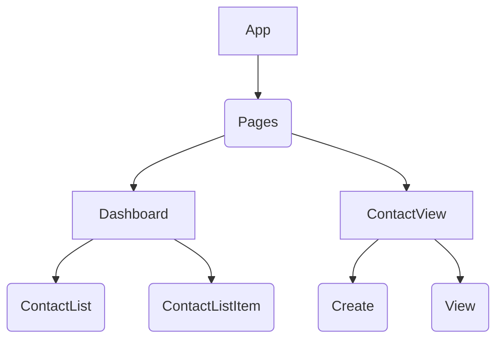

# Submission

## State Model
```
[
    {
        id: 1,
        firstname: "First Name",
        lastname: "Last Name",
        street: "Street 1",
        city: "City 1"
    }
]
```

## Component tree
